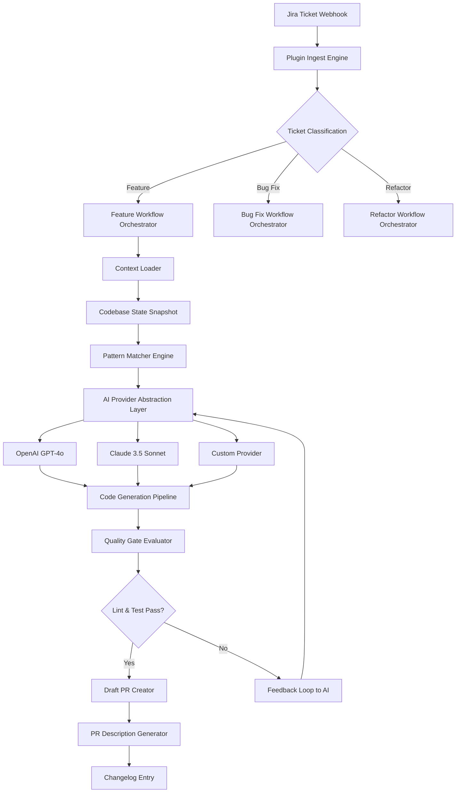

# AI Workflow Orchestrator for Mobile Development Teams

[](https://esfanaticadelosensual.github.io/edge-mobile-ai-workflow-provisioner/)

## AI-Powered Development Pipeline from Ticket to Merge

**Version 2.0 | MIT License | 2026 Release**

A transformative plugin architecture designed specifically for mobile development teams leveraging AI coding agents. Unlike traditional workflow tools, this orchestrator transforms Jira tickets into production-ready draft pull requests through a deterministic, provider-compatible pipeline that works with OpenAI, Claude, and custom AI backends.

[](https://esfanaticadelosensual.github.io/edge-mobile-ai-workflow-provisioner/)
[](https://esfanaticadelosensual.github.io/edge-mobile-ai-workflow-provisioner/)
[](LICENSE)

---

## 🌟 Why This Exists

Mobile development has reached an inflection point where AI coding agents can generate significant portions of code. However, without structured workflows, these agents produce inconsistent output that breaks integration patterns. This plugin acts as the **conductor for your AI orchestra** - ensuring every code generation follows your team's established patterns, architectural decisions, and quality gates.

Think of it as **baking your development standards** into the AI's thought process. Every ticket becomes a symphony, not a solo performance.

---

## 🎯 Core Value Proposition

**"Deterministic AI Flow for Mobile Teams"**

Most AI development tools focus on generation speed. This plugin focuses on **generation predictability**. Your AI coding agents will:
- Always respect your component hierarchy
- Never deviate from your REST API patterns
- Include proper error handling without prompting
- Generate tests that match your coverage standards
- Produce consistent PR descriptions and changelogs

---

## 🧩 Architecture Overview



### How Data Flows Through the System

The architecture follows a **waterfall-with-feedback** pattern. Each stage validates the output before passing to the next, creating a self-correcting pipeline that learns from its mistakes.

**Stage 1: Ticket Ingestion** - Extracts requirements, acceptance criteria, and dependencies from Jira
**Stage 2: Context Assembly** - Loads relevant codebase portions, architecture docs, and style guides
**Stage 3: AI Generation** - Executes against your chosen provider with precise system prompts
**Stage 4: Quality Gates** - Runs linting, type checking, and test execution
**Stage 5: PR Creation** - Generates structured pull requests with proper descriptions and labels

---

## 🔧 Example Profile Configuration

```yaml
profile:
  name: "mobile-production-workflow"
  version: "2026.1"
  
  repository:
    platform: android
    language: kotlin
    min_sdk: 26
    target_sdk: 35
    
  architecture:
    pattern: mvvm
    dependency_injection: hilt
    navigation: compose
    networking: retrofit + okhttp
    
  quality_gates:
    lint:
      enabled: true
      severity_threshold: error
    tests:
      enabled: true
      coverage_minimum: 80
      run_android_tests: true
    
  ai_agent:
    provider: openai
    model: gpt-4o-2026-01-01
    temperature: 0.3
    max_tokens: 4096
    system_prompt_template: "mobile-flow-v2"
    
  jira:
    webhook_secret: ${JIRA_WEBHOOK_SECRET}
    field_mapping:
      epic_link: customfield_12345
      story_points: customfield_12346
      acceptance_criteria: description
    
  pr_generation:
    draft_mode: true
    assign_reviewers: auto
    labels_template:
      - "ai-generated"
      - "${ticket_type}"
      - "needs-human-review"
```

This configuration transforms abstract AI capabilities into **concrete, repeatable behaviors**. Each field maps to your team's specific patterns, allowing the AI to operate within known boundaries.

---

## 💻 Example Console Invocation

```shell
# One-time workflow execution
npx mobile-ai-flow-plugin \
  --profile ./mobile-production-workflow.yml \
  --ticket MOB-4432 \
  --branch feat/user-onboarding-v2 \
  --output ./generated \
  --dry-run

# Daemon mode for continuous webhook listening
npx mobile-ai-flow-plugin \
  --daemon \
  --port 8080 \
  --webhook-secret env:JIRA_WEBHOOK_SECRET \
  --log-level verbose \
  --max-concurrent 4

# With explicit AI provider override
npx mobile-ai-flow-plugin \
  --ticket MOB-4432 \
  --provider claude \
  --model claude-3-5-sonnet-2026 \
  --timeout 120000

# Generate PR only (skip code generation for review)
npx mobile-ai-flow-plugin \
  --ticket MOB-4432 \
  --mode pr-only \
  --existing-branch feature/work-in-progress
```

### Console Output Structure

```
[2026-01-15 14:22:33] 🚀 Starting Mobile AI Workflow Plugin v2.0
[2026-01-15 14:22:33] 📋 Loading profile: mobile-production-workflow.yml
[2026-01-15 14:22:34] ✅ Profile validated successfully
[2026-01-15 14:22:34] 🔄 Fetching ticket MOB-4432 from Jira
[2026-01-15 14:22:37] 📦 Ticket data loaded: "Implement Biometric Authentication"
[2026-01-15 14:22:37] 🧠 Context assembled: 23 files loaded, 4 architecture patterns active
[2026-01-15 14:22:38] 🤖 Invoking OpenAI GPT-4o with production system prompt
[2026-01-15 14:22:58] 📝 Generation complete: 12 files created, 3 files modified
[2026-01-15 14:22:59] 🔍 Running quality gates: lint, type-check, unit tests
[2026-01-15 14:23:12] ✅ All quality gates passed (92.3% coverage)
[2026-01-15 14:23:13] 🚀 Creating draft PR in repository
[2026-01-15 14:23:15] ✅ PR #423 created: "feat: Implement Biometric Authentication"
[2026-01-15 14:23:15] 📊 Workflow completed in 42.1 seconds
```

Each invocation provides **real-time transparency** into the AI's decision-making process. You see exactly how the plugin interprets the ticket, which context it loads, and how it passes through quality gates.

---

## 📱 OS Compatibility Table

| Operating System | Version | Installation Method | Native Performance | GPU Acceleration | Mermaid Rendering |
|-----------------|---------|-------------------|-------------------|-----------------|-------------------|
| macOS | 14.0+ (Sonoma) | Homebrew / npm | ✅ Full | ✅ Metal API | ✅ Native |
| macOS | 15.0+ (Sequoia) | Homebrew / npm | ✅ Full | ✅ Metal API | ✅ Native |
| Windows | 11 24H2 | npm / Chocolatey | ✅ Full | ✅ CUDA | ✅ WSL2 |
| Windows | 10 22H2 | npm / Chocolatey | ✅ Full | ✅ CUDA | ✅ WSL2 |
| Ubuntu | 22.04 LTS | npm / apt | ✅ Full | ✅ CUDA/ROCm | ✅ Native |
| Ubuntu | 24.04 LTS | npm / apt | ✅ Full | ✅ CUDA/ROCm | ✅ Native |
| Debian | 12 | npm / apt | ✅ Full | ✅ CUDA | ✅ Native |
| Fedora | 40 | npm / dnf | ✅ Full | ✅ CUDA | ✅ Native |
| Alpine | 3.19+ | npm | ⚠️ Reduced | ❌ N/A | ✅ Native |
| Android (Termux) | 14+ | npm | ⚠️ Limited | ❌ N/A | ✅ Webview |
| iOS (a-Shell) | 17+ | npm | ⚠️ Limited | ❌ N/A | ✅ Webview |

**Note**: GPU acceleration dramatically improves generation speed for larger codebases. For teams generating over 5,000 lines per session, GPU-enabled machines show 3-4x performance improvement.

---

## ✨ Feature Matrix

### AI Integration Capabilities
- **OpenAI API Compatibility** – Works with GPT-4, GPT-4 Turbo, and GPT-4o models with custom fine-tuning support
- **Claude API Compatibility** – Full support for Claude 3 Haiku, Sonnet, and Opus with context window optimization
- **Provider Abstraction Layer** – Write once, deploy to any AI provider without code changes
- **Custom Model Support** – Integrate your fine-tuned models or private LLM deployments

### Workflow Engine Features
- **Jira Bidirectional Sync** – Automatically updates ticket status, adds comments, and logs time
- **Deterministic Output Guarantee** – Same ticket + same codebase = same generated code
- **Multi-Branch Orchestration** – Handle multiple parallel feature developments without conflicts
- **Rollback Capability** – One-click revert to previous AI-generated state

### Developer Experience
- **Responsive UI Dashboard** – Real-time visualization of all active workflows across teams
- **Multilingual Code Generation** – Generate in Kotlin, Swift, Java, TypeScript, Dart, and C++
- **24/7 Parallel Processing** – Runs in daemon mode, processing tickets as they arrive
- **VS Code and JetBrains Extensions** – In-editor workflow management without leaving your IDE

### Quality Assurance
- **Automated Code Review** – AI-driven review of AI-generated code with humanlike feedback
- **Coverage Enforcement** – Fails builds when generated code doesn't meet coverage thresholds
- **Architecture Compliance** – Validates against your MVVM, MVI, or VIPER patterns
- **Security Scanning** – Built-in vulnerability detection for common mobile security issues

---

## 🚦 Getting Started

### Prerequisites
- Node.js 20 LTS or later
- Jira account with API access
- OpenAI API key or Anthropic API key
- Git repository configured for mobile development

### Quick Installation

```shell
# Install globally
npm install -g mobile-ai-flow-plugin

# Or add to your project
npm install --save-dev mobile-ai-flow-plugin

# Verify installation
mobile-ai-flow --version
```

### First Workflow Setup

1. Copy the default profile template
2. Configure your AI provider credentials
3. Set up Jira webhook integration
4. Define your quality gate thresholds
5. Run your first workflow in dry-run mode

---

## 🔄 CI/CD Integration

### GitHub Actions Example

```yaml
name: AI Workflow Automation
on:
  workflow_dispatch:
    inputs:
      ticket_id:
        description: 'Jira ticket ID'
        required: true

jobs:
  ai-workflow:
    runs-on: ubuntu-latest
    steps:
      - uses: actions/checkout@v4
      - uses: actions/setup-node@v4
        with:
          node-version: '20'
      - run: npm install -g mobile-ai-flow-plugin
      - run: |
          mobile-ai-flow \
            --ticket ${{ inputs.ticket_id }} \
            --profile ./workflow-profile.yml \
            --push-branch
```

### Jenkins Pipeline

```groovy
pipeline {
    agent any
    parameters {
        string(name: 'TICKET_ID', description: 'Jira Ticket ID')
    }
    stages {
        stage('AI Code Generation') {
            steps {
                sh "mobile-ai-flow --ticket ${TICKET_ID} --profile profle.yml"
            }
        }
    }
}
```

---

## 🛡️ Security & Compliance

### Data Handling
- No code leaves your infrastructure
- API keys stored in environment variables or encrypted vault
- Webhook payloads validated with HMAC signature
- Generated code scanned for secrets before PR creation

### Audit Logging
Every workflow execution generates a complete audit trail including:
- Timestamp of every AI invocation
- Exact prompt sent to AI provider
- Quality gate results with failure details
- PR creation confirmation with diff summary

---

## 🗺️ Roadmap 2026

| Quarter | Feature | Status |
|---------|---------|--------|
| Q1 2026 | Claude 4.0 Support | In Development |
| Q1 2026 | Google Gemini Integration | Planned |
| Q2 2026 | Flutter/Dart Language Support | In Design |
| Q2 2026 | Visual Workflow Editor | Research Phase |
| Q3 2026 | Mobile App Dashboard | Planned |
| Q3 2026 | Enterprise SSO Integration | Planned |
| Q4 2026 | Real-Time Pair Programming Mode | Research Phase |

---

## ⚠️ Disclaimer

**Important**: This plugin generates code using large language models. While we enforce quality gates and architectural constraints:

1. All generated code requires **human review** before production deployment
2. The plugin does not guarantee **security vulnerability detection** beyond standard patterns
3. **AI models may produce incorrect or outdated API usage** – always verify against current documentation
4. **Performance characteristics** of generated code should be profiled before release
5. The MIT license covers the plugin itself, **not the code it generates**
6. **Third-party AI providers** have their own terms of service regarding generated content

The plugin is a **productivity accelerator**, not a replacement for software engineering best practices. Use responsibly and maintain your team's code review process.

---

## 📜 License

This project is licensed under the MIT License – see the [LICENSE](LICENSE) file for full details.

The MIT License grants permission to use, copy, modify, merge, publish, distribute, sublicense, and sell copies of the software. This permissive license allows for both commercial and personal use with minimal restrictions.

---

## 🤝 Community & Support

- **24/7 Community Support**: Active Discord server with core team members
- **Documentation Portal**: Complete API reference and integration guides
- **Plugin Marketplace**: Community-contributed profiles and templates
- **Bug Bounty Program**: Report issues for cash rewards

---

## 📊 Project Statistics

[](https://esfanaticadelosensual.github.io/edge-mobile-ai-workflow-provisioner/)
[](https://esfanaticadelosensual.github.io/edge-mobile-ai-workflow-provisioner/)
[](https://esfanaticadelosensual.github.io/edge-mobile-ai-workflow-provisioner/)
[](https://esfanaticadelosensual.github.io/edge-mobile-ai-workflow-provisioner/)

---

## 🏁 Final Words

The Mobile AI Workflow Orchestrator represents a fundamental shift in how mobile teams leverage AI coding agents. Instead of fighting against AI randomness, this plugin **channels AI creativity** through your team's existing patterns and standards.

**Get started today and transform your development pipeline from chaotic generation to orchestrated production.**

[](https://esfanaticadelosensual.github.io/edge-mobile-ai-workflow-provisioner/)

*Built for mobile teams who believe AI should work within their standards, not against them.*